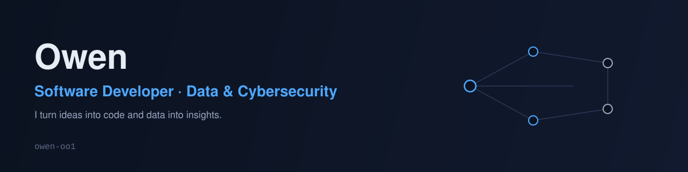

  

 

### I turn ideas into code and data into insights.

I'm Owen — a self-taught and formally trained developer working across software development, data, and cybersecurity. My path started with animation (Blender 3D, with a friend, Jason), which pulled me into Python for automation, then into IoT and electronics through a love of physics, and eventually into data and security. I approach development as both art and craft: logic and structure, with room for creativity.

I'm drawn to projects that blend hardware and software, automation, and data-driven systems that solve real problems — and I care about understanding the *why* behind the *how*, not just shipping something that works.

 

### Skills

`PowerBI` `AWS` `React` `C/C++` `JavaScript` `Node.js` `Python` `Machine Learning` `REST` `MySQL` `PostgreSQL` `Firebase` `WordPress` `Shopify` `HTML` `CSS` `Next.js` `Apache Airflow` `CI/CD` `Docker` `Apache Spark` `ETL`

 

### Projects

**Naivas Customer Relationship & Shopping List App**
A mini-CRM that turns customer shopping intent into actionable retail insights.

**Secure CLI Messaging Application**
A security-focused command-line messaging platform exploring practical cryptography, authentication, and secure network communication.

**More on my website. Link at the end**

 

### Education

- Bachelor of Science in Business Information Technology (BBIT) — The Co-operative University of Kenya
- Cyber Security Essentials 1 & Introduction to Cyber Security — Cisco Networking Academy
- Data Engineering — ALX Africa
- Data Science — ALX Africa
- Data Analytics — ALX Africa
- 100 Days of Web Development Bootcamp — Udemy

 

### Connect

Portfolio: [owens-portfolio.vercel.app](https://owens-portfolio.vercel.app/)

 
